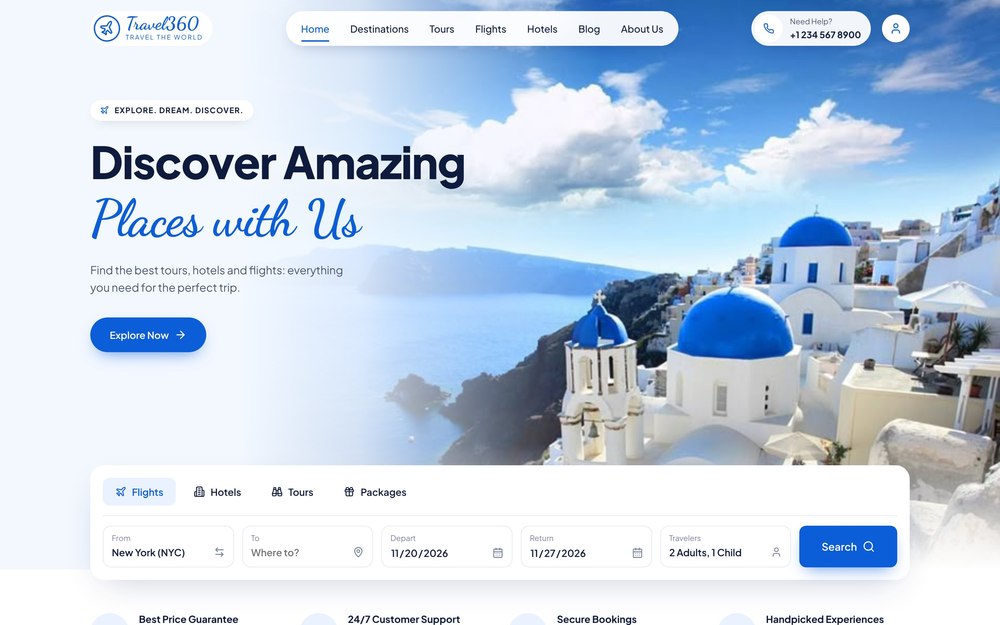
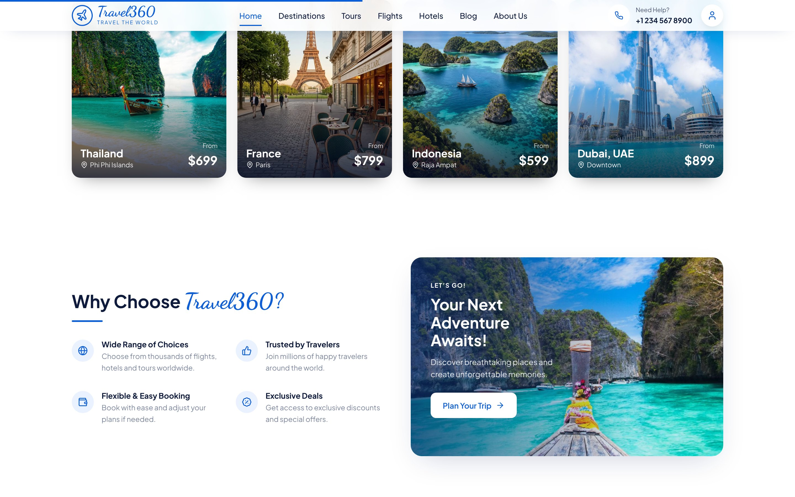
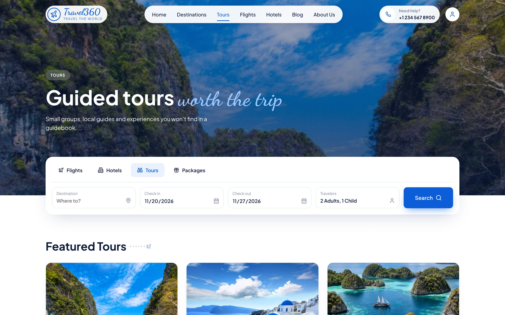
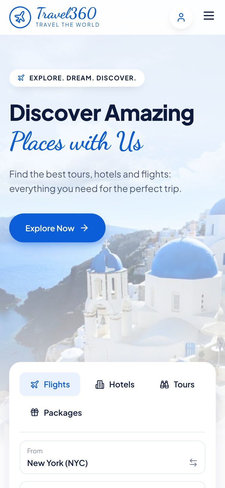

# Travel360 — Travel Booking Website

**Live demo:** https://travel360-beige.vercel.app

A responsive, multi-page travel agency website built from a UI design concept, with smooth scroll-driven animations.



## Highlights

- **7 pages:** Home, Destinations (with filters), Tours, Flights, Hotels, Blog and About
- **Scroll motion:** parallax hero, fade/slide-in sections, staggered cards, a scroll-linked photo strip and a reading-progress bar
- **Fully responsive:** desktop, tablet and phone layouts with a mobile menu
- **Booking search UI:** Flights / Hotels / Tours / Packages tabs
- **Accessible motion:** animations switch off for users who enable "reduce motion"
- **Fast:** built with Vite and deployed on Vercel

| Sections | Tours page | Mobile |
| --- | --- | --- |
|  |  |  |

## Tech stack

React 18 · Vite · React Router · Framer Motion · Lucide icons · CSS · Vercel

## Run locally

```bash
npm install
npm run dev     # local dev server
npm run build   # production build in dist/
```

Images live in `public/images/`; page content (destinations, tours, hotels, posts) is in `src/data/destinations.js`.

> This is a demo/portfolio project: prices, reviews and contact details are placeholders, and booking forms are not connected to a backend.
